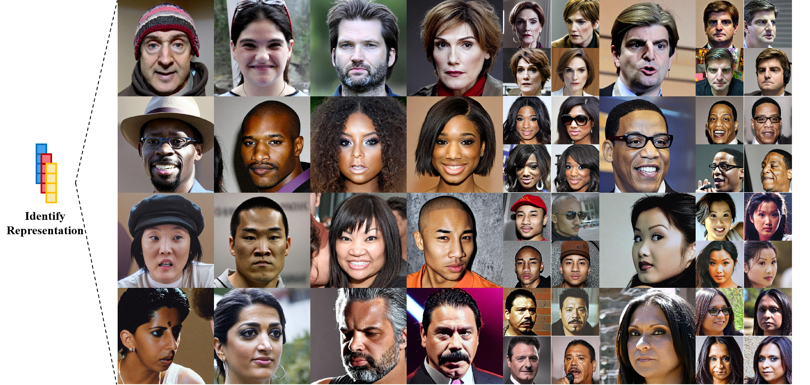

## Rep2Face: Synthetic Face Generation with Identity Representation Sampling <br><sub>Official PyTorch Implementation</sub>



This repo contains PyTorch model definitions, pre-trained weights and training/sampling code for our paper exploring Rep2Face.

## Setup

We provide an [`environment.yml`](environment.yml) file that can be used to create a Conda environment.

```bash
conda env create -f environment.yml
conda activate Rep2face
```


## Sampling

Pre-trained checkpoints are too large and will be provided later.

**Identity Sampling.** You can sample from our pre-trained IRDM models with [`id_sample_ddp.py`](id_sample_ddp.py). For example, to sample from
our model, you can use:

```bash
CUDA_VISIBLE_DEVICES=0,1 torchrun --nnodes=1 --nproc_per_node=2 image_generate_ddp.py
```

**Image Generation.** You can generate from pre-trained models with [`image_generate_ddp.py`](image_generate_ddp.py). For example, to generate from
our model, you can use:

```bash
CUDA_VISIBLE_DEVICES=0,1 torchrun --nnodes=1 --nproc_per_node=2 image_generate_ddp.py
```

## Training IRDM

We provide a training script for IRDM in [`train.py`](train.py). To launch IRDM training with GPUs on 
one node:

```bash
CUDA_VISIBLE_DEVICES=0,1,2,3,4,5,6,7 torchrun --nnodes=1 --nproc_per_node=8 train.py
```

## License
The code and model weights are licensed under MIT License. See [`LICENSE.txt`](LICENSE.txt) for details.
